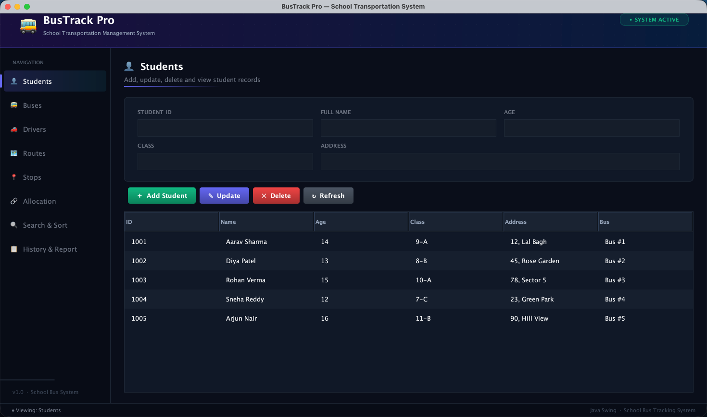
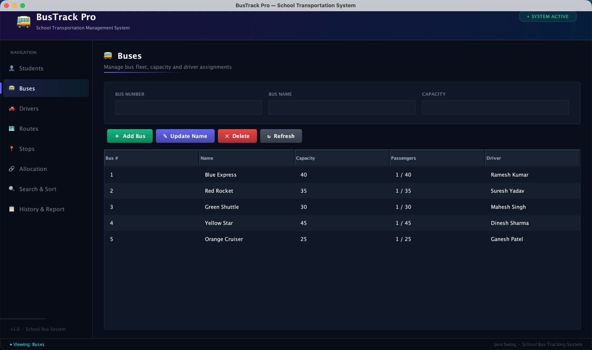
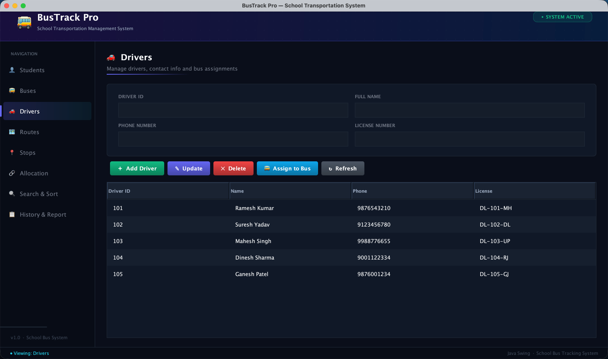
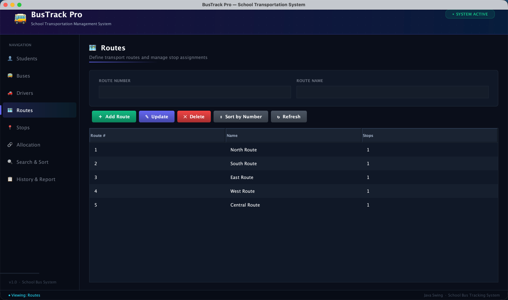
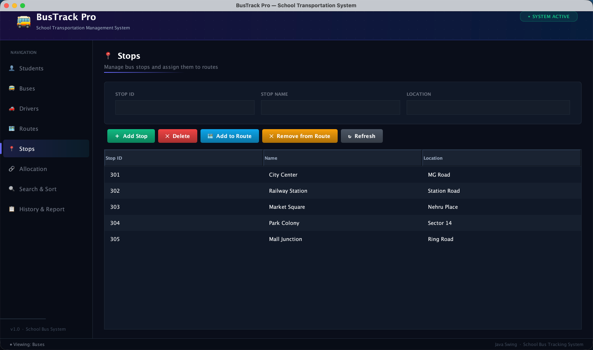
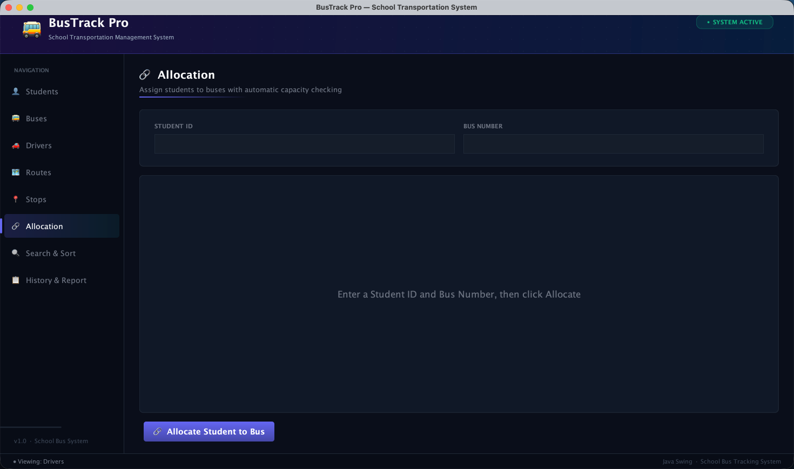
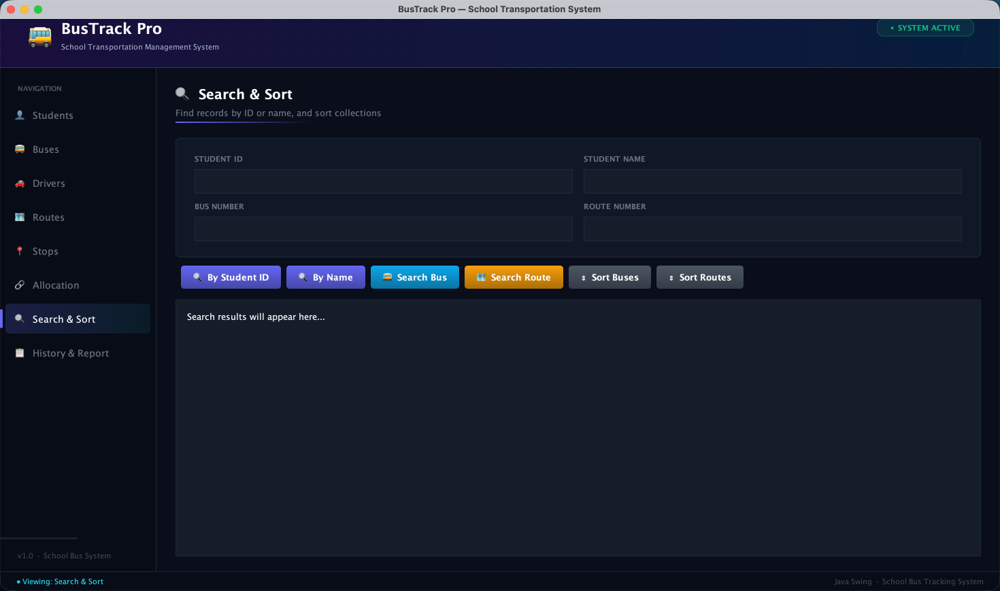
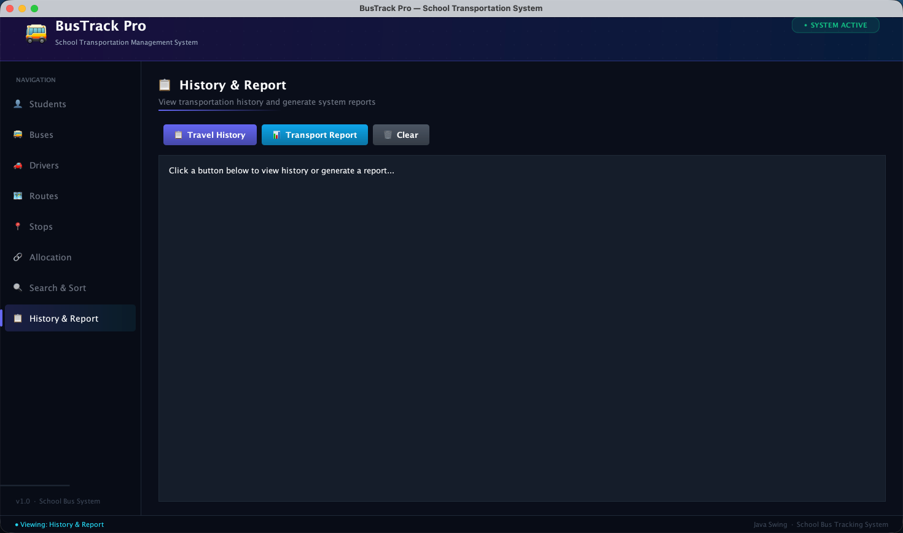

# School Bus Tracking and Management System

**Case Study 42 — B.Tech CSE 2025-29 | Java Programming | Semester III**  
**Student Name:** Daksh Ranjan Srivastava  
**Roll Number:** 150096725087

A desktop application built with Java Swing to manage school transportation. Administrators can manage buses, drivers, students, routes, and stops, assign students to buses, search records, sort data, and generate transport reports — all from a single dark-themed GUI.

---

## Problem Statement

A school requires a system to manage buses, drivers, routes, students, and transportation schedules. The system should maintain student transportation records and allow administrators to monitor route assignments efficiently.

---

## Objectives

- Manage buses and drivers
- Register students for transportation
- Manage routes and stops
- Assign students to buses
- Search and sort transportation records
- Maintain route and student history

---

## Java Concepts Used

| Java Concept         | Application in Project                              |
|----------------------|-----------------------------------------------------|
| Classes and Objects  | `Bus`, `Driver`, `Student`, `Route`, `Stop`         |
| Constructors         | Initialization of all domain objects                |
| Array                | Bus seating capacity (`Student[]` inside `Bus`)     |
| ArrayList            | Buses list, Students list, Drivers list             |
| LinkedList           | Route stops, Transportation history                 |
| HashMap              | Bus Number to Bus object lookup                     |
| TreeMap              | Routes sorted by route number (auto-sorted)         |
| CRUD Operations      | Full create/read/update/delete for all entities     |
| Searching            | Search student by ID or name, bus by number, route  |
| Sorting              | Sort buses by capacity, routes by number            |
| Swing GUI            | Full desktop interface with sidebar navigation      |
| Exception Handling   | `TransportationException` for bus capacity exceeded |
| Validation           | Student details, bus capacity, route and bus fields |

---

## Project Structure

```
SchoolBusTrackingSystem/
├── src/
│   ├── Main.java              # Controller — all data structures and business logic
│   ├── TransportGUI.java      # Swing GUI — 8-panel sidebar navigation
│   ├── Bus.java               # Bus entity with Student[] seating array
│   ├── Student.java           # Student entity
│   ├── Driver.java            # Driver entity
│   ├── Route.java             # Route entity with LinkedList<Stop>
│   ├── Stop.java              # Stop entity
│   └── TransportationException.java  # Custom exception
├── out/                       # Compiled .class files
├── screenshots/               # GUI screenshots
├── .gitignore
└── README.md
```

---

## Modules

1. **Student Management** — Add, update, delete, and view all students
2. **Bus Management** — Manage bus fleet, capacity, and driver assignments
3. **Driver Management** — Register drivers and assign them to buses
4. **Route Management** — Define transport routes with stop counts
5. **Stop Management** — Add stops and assign them to routes
6. **Student Bus Allocation** — Assign students to buses with capacity enforcement
7. **Search and Sort** — Search by ID/name; sort buses by capacity, routes by number
8. **History and Report** — View travel history log and full system report

---

## How to Run

**Prerequisites:** JDK 11 or higher

```bash
# Compile
javac -d out src/*.java

# Run
java -cp out Main
```

The application pre-loads 5 demo records in every module on startup so you can explore all features immediately.

---

## GUI Screenshots

### Students Panel
Displays all registered students with their assigned bus. Click any row to prefill the form for quick edits.



---

### Buses Panel
Shows all buses with capacity, current passenger count, and assigned driver.



---

### Drivers Panel
Manage driver records and assign drivers to buses.



---

### Routes Panel
Lists all routes with stop count. Routes are stored in a TreeMap (auto-sorted by route number).



---

### Stops Panel
Manage bus stops and assign them to routes.



---

### Allocation Panel
Assign a student to a bus. Capacity is enforced — if the bus is full, a `TransportationException` is raised and the student's previous bus assignment is preserved (atomic operation).



---

### Search and Sort Panel
Search students by ID or name, search buses and routes, and sort records.



---

### History and Report Panel
View a log of all allocation events and generate a full system transport report.



---

## Key Design Decisions

**Atomic Bus Allocation**
Capacity is checked before removing the student from their previous bus. This prevents a student being left without a bus if the new bus turns out to be full.

**Click-to-Prefill**
Clicking any row in a table automatically fills the form fields above it, eliminating manual re-entry when updating or deleting records.

**HashMap for O(1) Bus Lookup**
Bus searches use a `HashMap<Integer, Bus>` instead of iterating the `ArrayList`, giving constant-time lookup by bus number.

**TreeMap for Route Storage**
Routes are stored in a `TreeMap<Integer, Route>` which keeps them sorted by route number at all times without a separate sort step.

**Custom Exception**
`TransportationException` is thrown when a student allocation attempt exceeds bus capacity, separating transport-domain errors from generic exceptions.

---

## Conclusion

The application demonstrates the practical use of Java data structures (`ArrayList`, `LinkedList`, `HashMap`, `TreeMap`) and GUI programming with Java Swing to manage school transportation and route allocation efficiently. Exception handling and validation ensure data integrity throughout all operations.

---

## Project Information

- **Student Name:** Daksh Ranjan Srivastava
- **Roll Number:** 150096725087
- **Program:** B.Tech Computer Science and Engineering (2025-29)
- **Course:** Java Programming | Semester III
- **Case Study:** Case Study 42 — School Bus Tracking & Management System
